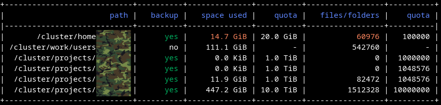

# dusage

Show disk usage and quota on a cluster. Supports
[BeeGFS](https://en.wikipedia.org/wiki/BeeGFS) and
[Lustre](https://en.wikipedia.org/wiki/Lustre_(file_system)).



Available options:

```console
$ dusage --help

Usage: dusage [OPTIONS]

Options:
  -u, --user TEXT       The username to check (default: *****).
  -p, --project TEXT    The allocation project.
  -d, --directory TEXT  The directory/path to check.
  --no-colors           Disable colors.
  --help                Show this message and exit.
```


## Installation

1. Clone this repository
2. Change into the `_dusage` folder
3. Run the [install.sh](_dusage/install.sh) script inside the `_dusage` folder
4. Adjust [dusage.cfg](_dusage/dusage.cfg) to your cluster
5. Change `undefined_hostname` in [dusage](dusage)
5. Run [dusage](dusage)


## Separation into a front-end and a back-end

This effort is on-going. The back-end is taking shape (see below), but the
front-end still needs quite a bit of work. Essentially, the front-end is
missing and the back-end is not yet used.


## Front-end

Work in progress. More documentation soon.


## Back-end

Design choices:
- All back-end code is contained within one file:
  [dusage_backend.py](_dusage/dusage_backend.py)
- Local configuration can be done outside the Python code. Example:
  [dusage.cfg](_dusage/dusage.cfg)
- No external library dependencies. Only depends on the standard library.
- Interface functions return a dictionary instead of a
  [dataclass](https://docs.python.org/3/library/dataclasses.html) (which we
  wanted to use initially) to work on old Python versions typically found on
  clusters (Python 3.7 is too new for some clusters).
- All functions that start with an underscore are internal.

The back-end provides 3 interface functions:
- `quota_using_account`
- `quota_using_project`
- `quota_using_path`

Let us consider an actual example. You need a configuration file where
you can localize the settings. Every time you call an API function, you need
to point it to the configuration file.

Here is the configuration file ([dusage.cfg](_dusage/dusage.cfg)) that we use for our clusters at
[NRIS](https://documentation.sigma2.no/):
```ini
[DEFAULT]
file_system_prefix = /cluster/
home_prefix = /cluster/home/
scratch_prefix = /cluster/work/users/
project_path_prefixes = /cluster/projects/, /cluster/shared/

[saga]
file_system = beegfs
path_based = no

[fram]
file_system = lustre
path_based = no

[betzy]
file_system = lustre
path_based = yes
```

Now let us call the 3 API functions. The `pprint` used in the example below is
only to make the returned dictionary more readable here:
```python
from pprint import pprint

from dusage_backend import quota_using_project, quota_using_account, quota_using_path


result = quota_using_project(
    config_file="dusage.cfg", cluster="betzy", project="nn1234k"
)
pprint(result)
# example output:
# {'/cluster/projects/nn1234k': {'inodes_hard_limit': 1000000,
#                                'inodes_soft_limit': 1000000,
#                                'inodes_used': 1,
#                                'space_hard_limit_bytes': 1099511627776,
#                                'space_soft_limit_bytes': 1099511627776,
#                                'space_used_bytes': 4096}}


result = quota_using_account(config_file="dusage.cfg", cluster="betzy", account="somebody")
pprint(result)
# example output:
# {'/cluster/home/somebody': {'inodes_hard_limit': 110000,
#                             'inodes_soft_limit': 100000,
#                             'inodes_used': 1317,
#                             'space_hard_limit_bytes': 32212254720,
#                             'space_soft_limit_bytes': 21474836480,
#                             'space_used_bytes': 369164288},
#  '/cluster/projects/nn1234k': {'inodes_hard_limit': 1000000,
#                                'inodes_soft_limit': 1000000,
#                                'inodes_used': 1,
#                                'space_hard_limit_bytes': 1099511627776,
#                                'space_soft_limit_bytes': 1099511627776,
#                                'space_used_bytes': 4096}}


result = quota_using_path(
    config_file="dusage.cfg", cluster="betzy", path="/cluster/home/somebody"
)
pprint(result)
# example output:
# {'/cluster/home/somebody': {'inodes_hard_limit': 110000,
#                             'inodes_soft_limit': 100000,
#                             'inodes_used': 1317,
#                             'space_hard_limit_bytes': 32212254720,
#                             'space_soft_limit_bytes': 21474836480,
#                             'space_used_bytes': 369164288}}
```
